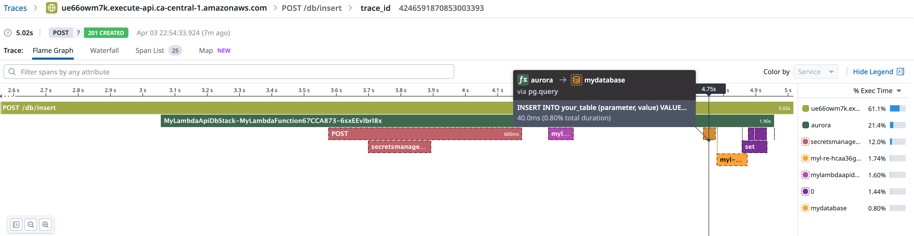

# Deploy

## prerequisite
run the bootstrap step in the region you're going to deploy to
```bash
cdk bootstrap
```

## deploy the cdk
```bash
npm install
npm run deploy
```

## update
```bash
npm run deploy
```

# Create the table
```bash
curl -X POST ${API_URL}db/create-table
```

The response should look like:

```json
{
  "message": "Table created successfully"
}
```

# Update records
You can test the insert endpoint by sending a POST request with the required parameters:

```bash
# Call the insert endpoint with sample data
curl -X POST ${API_URL}db/insert \
  -H "Content-Type: application/json" \
  -d '{
    "parameter": "example_param",
    "value": "This is an example value"
  }'
```
In Datadog > APM > Traces > Explorer, search by `service:aurora` and the expected trace looks like following.


# Check records
```bash
curl -X GET "${API_URL}db/get-record?parameter=example_param"
```
In Datadog > APM > Traces > Explorer, search by `service:aurora` and the expected trace looks like following.


# Useful commands
The `cdk.json` file tells the CDK Toolkit how to execute your app.

* `npm run build`   compile typescript to js
* `npm run watch`   watch for changes and compile
* `npm run test`    perform the jest unit tests
* `npx cdk deploy`  deploy this stack to your default AWS account/region
* `npx cdk diff`    compare deployed stack with current state
* `npx cdk synth`   emits the synthesized CloudFormation template
