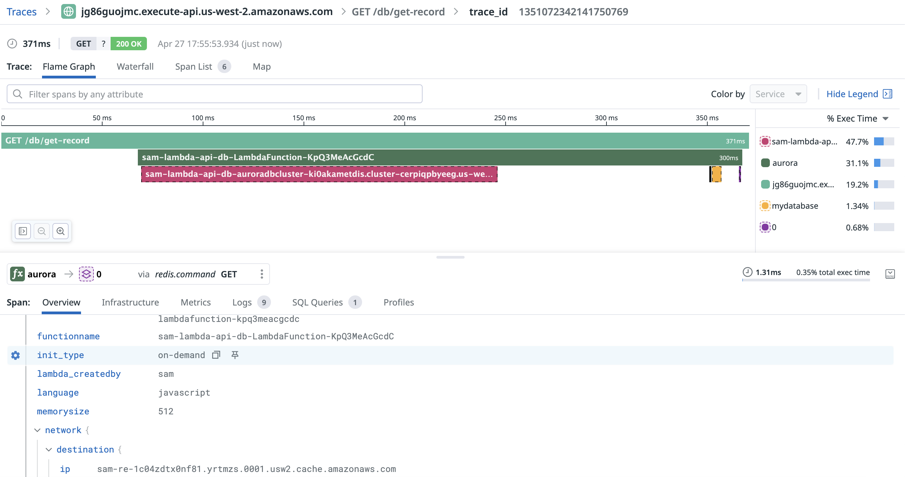

# SAM Lambda API with PostgreSQL and Redis

This project creates a serverless architecture with:
- Lambda function running Node.js 18
- API Gateway with three endpoints
- Aurora PostgreSQL database
- Redis ElastiCache cluster
- VPC with public and private subnets

## Prerequisites

- AWS CLI installed and configured
- SAM CLI installed
- Node.js 18.x and npm

## Project Structure

```
.
├── template.yaml             # SAM template
├── lambda/                   # Lambda function code
│   ├── index.ts              # Lambda handler
│   ├── package.json          # Dependencies
│   └── tsconfig.json         # TypeScript config
├── README.md                 # This file
├── build.sh                  # run this to build
├── deploy.sh                 # run this to build and deploy
└── samconfig.toml            # some configuration of the stack

```

## Setup and Deployment

### 1. Build

This includes npm install and tsc for the lambda code and sam build
```bash
./build.sh
```

### 2. Deploy with SAM
```bash
# Deploy (guided)
sam deploy --guided
```

### 3. Cleanup

To remove all resources created by this project:

```bash
sam delete
```

## API Endpoints

The API includes three endpoints:

1. **Create Table**: `POST /db/create-table`
   - Creates the database table if it doesn't exist

2. **Insert Record**: `POST /db/insert`
   - Request body: `{ "parameter": "your_param", "value": "your_value" }`
   - Inserts a record into the database and caches it in Redis

3. **Get Record**: `GET /db/get-record?parameter=your_param`
   - Retrieves records by parameter value
   - Checks Redis cache first, then falls back to database query

## Testing the API

You can use curl or Postman to test the API:

```bash
# Get API URL from CloudFormation Outputs
API_URL=$(aws cloudformation describe-stack-resources --stack-name your-stack-name --query "StackResources[?LogicalResourceId=='ServerlessRestApi'].PhysicalResourceId" --output text)

# Create the table
curl -X POST ${API_URL}/Prod/db/create-table

# Insert a record
curl -X POST ${API_URL}/Prod/db/insert \
  -H "Content-Type: application/json" \
  -d '{"parameter": "test_param", "value": "test_value"}'

# Get records by parameter
curl -X GET "${API_URL}/Prod/db/get-record?parameter=test_param"
```

## Architecture Notes

- The Lambda function is in a private subnet with NAT Gateway for internet access
- The Aurora PostgreSQL and Redis are in isolated private subnets
- Security groups control access between resources
- Database credentials are stored in AWS Secrets Manager


## Datadog

In Datadog > APM > Traces > Explorer, search by `service:aurora` and the expected trace looks like following.


